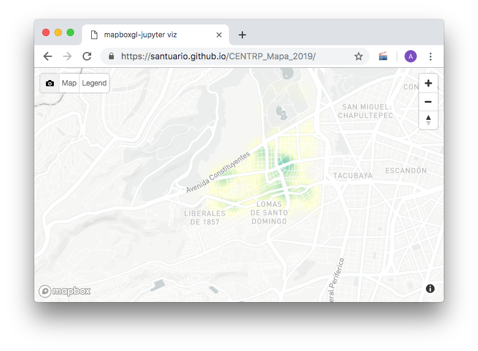

# Mapa de denuncias a las cercanías de CENTRO

En éste mapa se muesran las nenuncias a 5Km de nuestro campus universitario. Los datos salieron de la página de Datos abietos del gobierno de la ciudad de méxico https://adip.cdmx.gob.mx/

Se puede ver el mapa, en el siguiente enlace: https://santuario.github.io/CENTRP_Mapa_2019/